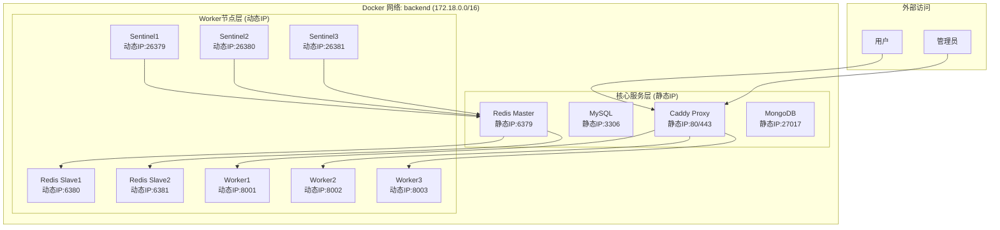

# docker-caddy 常规脚手架

基于 Docker Compose 的现代化开发环境，支持 Caddy 集群和 Redis 哨兵模式。

## 目录

- [项目特性](#项目特性)
- [快速开始](#快速开始)
- [服务架构](#服务架构)
- [环境配置](#环境配置)
- [部署模式](#部署模式)
- [管理命令](#管理命令)
- [网络架构](#网络架构)
- [项目结构](#项目结构)
- [开发指南](#开发指南)
- [故障排除](#故障排除)
- [致谢](#致谢)

## 项目特性

- **Caddy 集群模式**: 1个主实例 + 3个worker，支持负载均衡和故障转移
- **Redis 高可用**: 支持哨兵模式（1主2从3哨兵）和单机模式
- **环境变量配置**: 所有配置通过.env文件管理，支持动态配置
- **多语言支持**: Go、Python 测试和 Web 应用示例
- **统一管理**: Makefile 和专门脚本提供便捷的管理方式
- **开发友好**: 完整的测试套件和开发环境配置

## 快速开始

### 1. 环境初始化

```bash
# 克隆项目
git clone <repository-url>
cd docker-caddy

# 初始化 Docker 网络和数据目录
./init.sh

# 复制环境配置文件
cp .env.example .env

# 编辑配置文件（重要：Redis哨兵配置）
vim .env
```

### 2. 选择部署模式

#### Redis 哨兵模式（生产推荐）

```bash
# 启动 Redis 哨兵集群
make redis-start

# 检查哨兵状态
make redis-status

# 测试哨兵功能
make redis-test
```

#### Redis 单机模式（开发推荐）

```bash
# 启动单机 Redis
docker-compose up -d redis-master

# 测试单机 Redis
docker-compose exec -T redis-master redis-cli --no-auth-warning -a CG1rMeyRryFgvElf8n ping
```

#### Caddy 集群模式（生产推荐）

```bash
# 启动 Caddy 集群
make caddy-start

# 检查集群状态
make caddy-status
```

### 3. 验证部署

```bash
# 查看所有服务状态
make status

# 运行完整测试
make test-all
```

## 服务架构

### 服务组件

| 服务 | 版本 | 端口 | 说明 |
|------|------|------|------|
| Redis | 5.x (默认) | 6379-6381 | 支持哨兵模式和单机模式 |
| MySQL | 8.0 (默认) | 3306 | 关系型数据库 |
| MongoDB | 3.4 (默认) | 27017 | 文档数据库 |
| Caddy | 2.10 | 80/443 | 集群模式，负载均衡 |
| Go | 1.24 | 8080 | Web 应用示例 |
| Python | 3.x | 8081 | Web 应用示例 |

### Caddy 集群模式

```bash
# 启动 Caddy 集群
make caddy-start

# 检查集群状态
make caddy-status

# 查看集群日志
make caddy-logs

# 停止集群
make caddy-stop
```

> **详细文档**: 查看 [Caddy 配置文档](caddy/README.md) 了解完整的配置说明、使用方法和故障排除指南。

**集群架构**:

- 主入口: proxy (端口 80/443) - 负载均衡器
- Worker1: proxy-worker1 (端口 8001/1443)
- Worker2: proxy-worker2 (端口 8002/2443)
- Worker3: proxy-worker3 (端口 8003/3443)

**特性**:

- 轮询负载均衡算法
- 健康检查机制
- 自动故障转移
- 统一日志记录

### Redis 高可用模式

#### 哨兵模式（生产环境）

```bash
# 启动 Redis 哨兵模式
make redis-start

# 检查哨兵状态
make redis-status

# 测试哨兵功能
make redis-test

# 查看哨兵日志
make redis-logs

# 停止哨兵模式
make redis-stop
```

**哨兵架构**:

- 主节点: redis-master (端口 6379) - 处理写操作，使用静态IP
- 从节点: redis-slave1 (端口 6380), redis-slave2 (端口 6381) - 复制主节点数据，动态IP
- 哨兵节点: redis-sentinel1 (端口 26379), redis-sentinel2 (端口 26380), redis-sentinel3 (端口 26381) - 监控和故障转移，动态IP

**特性**:

- 智能动态配置：主节点静态IP，worker节点动态IP
- 环境变量管理：所有配置通过.env文件管理
- 自动故障检测和转移
- 主从自动切换
- 配置自动更新
- 高可用性保证

#### 单机模式（开发环境）

```bash
# 启动单机 Redis
docker-compose up -d redis-master

# 测试单机 Redis
docker-compose exec -T redis-master redis-cli --no-auth-warning -a CG1rMeyRryFgvElf8n ping

# 停止单机 Redis
docker-compose stop redis-master
```

**单机特性**:

- 轻量级部署
- 快速启动
- 适合开发和测试
- 无集群依赖

> **详细文档**: 查看 [Redis 配置文档](redis/README.md) 了解完整的配置说明、环境变量设置和使用注意事项。

## 环境配置

### 环境变量配置

在 `.env` 文件中配置Redis哨兵相关参数：

```bash
# Redis Configuration
REDIS_PASSWORD=CG1rMeyRryFgvElf8n
REDIS_IP=172.18.0.4

# Redis Sentinel Configuration
REDIS_SENTINEL_QUORUM=2                    # 哨兵法定人数
REDIS_SENTINEL_DOWN_AFTER_MS=5000         # 主节点下线检测时间（毫秒）
REDIS_SENTINEL_FAILOVER_TIMEOUT=10000     # 故障转移超时时间（毫秒）
```

### 配置说明

| 配置项 | 默认值 | 说明 |
|--------|--------|------|
| `REDIS_SENTINEL_QUORUM` | 2 | 哨兵法定人数，建议设置为 (哨兵节点数/2) + 1 |
| `REDIS_SENTINEL_DOWN_AFTER_MS` | 5000 | 主节点下线检测时间，值越小检测越敏感 |
| `REDIS_SENTINEL_FAILOVER_TIMEOUT` | 10000 | 故障转移超时时间，包括选择新主节点等操作 |

## 部署模式

### 开发环境（单机模式）

```bash
# 启动核心服务
docker-compose up -d redis-master mysql mongo

# 启动 Caddy
make caddy-start

# 查看状态
docker-compose ps
```

### 生产环境（集群模式）

```bash
# 启动 Redis 哨兵集群
make redis-start

# 启动 Caddy 集群
make caddy-start

# 启动其他服务
docker-compose up -d mysql mongo

# 查看集群状态
make status
```

## 管理命令

### 常用命令

```bash
# 查看所有可用命令
make help

# 服务管理
make status         # 查看所有服务状态
make logs           # 查看所有服务日志
make stop-all       # 停止所有服务
```

### Redis 管理

```bash
# Redis 哨兵模式
make redis-start    # 启动 Redis 哨兵集群
make redis-stop     # 停止 Redis 哨兵集群
make redis-status   # 检查哨兵状态
make redis-test     # 测试哨兵功能
make redis-logs     # 查看哨兵日志
make redis-restart  # 重启哨兵集群

# Redis 单机模式
docker-compose up -d redis-master     # 启动单机 Redis
docker-compose stop redis-master      # 停止单机 Redis
docker-compose restart redis-master   # 重启单机 Redis
```

### Caddy 管理

```bash
# Caddy 集群
make caddy-start    # 启动 Caddy 集群
make caddy-stop     # 停止 Caddy 集群
make caddy-status   # 检查集群状态
make caddy-logs     # 查看集群日志
```

### 测试和开发

```bash
# 测试管理
make test-go        # 运行 Go 语言测试
make test-py        # 运行 Python 语言测试
make test-all       # 运行所有测试

# Web 应用管理
make web-go         # 启动 Go Web 应用
make web-py         # 启动 Python Web 应用
make web-all        # 启动所有 Web 应用
```

### 传统 Docker Compose 方式

```bash
# 构建和启动
docker-compose build <services-names>
docker-compose up -d <services-names>

# 重启和重建
docker-compose restart <services-names>
docker-compose up -d --build <services-names>

# 停止和清理
docker-compose stop
docker-compose down
docker-compose down --rmi all
```

## 网络架构

Docker网络通过 `init.sh` 脚本自动创建和管理，避免固化IP配置。

### 网络创建

```bash
# 网络配置（由 init.sh 自动创建）
docker network create \
  --subnet=172.18.0.0/16 \
  --gateway=172.18.0.1 \
  --ip-range=172.18.1.0/24 \
  backend
```

### 网络设计说明

- **总子网范围**: `172.18.0.0/16` (172.18.0.0 - 172.18.255.255)
- **网关地址**: `172.18.0.1` (子网第一个可用IP)
- **自动分配范围**: `172.18.1.0/24` (172.18.1.0 - 172.18.1.255)
- **保留IP范围**: `172.18.0.2-172.18.0.255` (用于核心服务静态IP)

### IP分配策略

| IP范围 | 用途 | 说明 |
|--------|------|------|
| 172.18.0.1 | 网关 | Docker网络网关 |
| 172.18.0.2-172.18.0.255 | 核心服务 | 静态IP，用于proxy、redis-master、mysql、mongo |
| 172.18.1.0-172.18.1.255 | 扩展服务 | 动态IP，用于worker节点 |

### 网络拓扑



> **注意**: 网络配置由 `init.sh` 脚本管理，如需修改网络配置，请编辑 `init.sh` 文件。IP地址通过环境变量动态配置，避免硬编码。

### 服务类型

| 服务类型 | IP 范围 | 用途 | 配置方式 |
|---------|---------|------|----------|
| **核心服务** | 172.18.0.2-255 | 基础服务 | 通过环境变量静态配置 |
| **扩展服务** | 172.18.1.0-255 | Worker节点 | Docker自动动态分配 |

### 端口映射

#### 外部访问端口

| 服务 | 内部端口 | 外部端口 | 协议 | 说明 |
|------|----------|----------|------|------|
| Caddy Proxy | 80 | 80 | HTTP | 主入口 |
| Caddy Proxy | 443 | 443 | HTTPS | 主入口 |
| MySQL | 3306 | 3306 | TCP | 数据库 |
| MongoDB | 27017 | 27017 | TCP | 文档数据库 |
| Redis Master | 6379 | 6379 | TCP | 主节点 |
| Redis Slave1 | 6379 | 6380 | TCP | 从节点1 |
| Redis Slave2 | 6379 | 6381 | TCP | 从节点2 |
| Redis Sentinel1 | 26379 | 26379 | TCP | 哨兵1 |
| Redis Sentinel2 | 26379 | 26380 | TCP | 哨兵2 |
| Redis Sentinel3 | 26379 | 26381 | TCP | 哨兵3 |

### 服务间通信

- **内部通信**：所有服务通过容器名进行通信
- **外部访问**：通过宿主机端口映射访问
- **网络管理**：使用 `init.sh` 脚本自动创建和管理网络
- **负载均衡**：Caddy 自动分发请求到 Worker 节点
- **故障转移**：Redis 哨兵自动处理主从切换

#### 安全考虑

- **网络隔离**：所有服务运行在独立的 Docker 网络中
- **端口控制**：只暴露必要的端口到宿主机
- **访问控制**：通过 Caddy 进行统一的访问控制

## 项目结构

```txt
docker-caddy/
├── caddy/                   # Caddy 配置
│   ├── README.md            # Caddy 配置详细说明
│   ├── Caddyfile            # 主配置文件
│   ├── conf.d/              # 站点配置
│   │   ├── 00-example-caddy # 站点配置模板
│   │   ├── 02-www.caddy     # 主站点配置
│   │   ├── 03-api.caddy     # API 接口配置
│   │   └── 04-admin.caddy   # 管理后台配置
│   └── Dockerfile           # Caddy 镜像
├── redis/                   # Redis 配置
│   ├── README.md            # Redis 配置详细说明
│   ├── redis5.conf          # Redis 5.x 配置
│   ├── sentinel.conf        # 哨兵配置（动态生成）
│   ├── sentinel.conf.template # 哨兵配置模板
│   └── Dockerfile           # Redis 镜像
├── mysql/                   # MySQL 配置
│   ├── docker.cnf           # MySQL 配置
│   └── Dockerfile           # MySQL 镜像
├── mongo/                   # MongoDB 配置
│   ├── mongod.conf          # MongoDB 配置
│   └── Dockerfile           # MongoDB 镜像
├── grpc/                    # gRPC 服务
│   ├── main.go              # gRPC 服务代码
│   ├── go.mod               # Go 模块文件
│   ├── go.sum               # Go 依赖锁定
│   └── Dockerfile           # gRPC 镜像
├── test/                    # 测试代码
│   ├── go/                  # Go 语言测试
│   │   ├── redis-config.go  # Redis 配置
│   │   ├── test-redis.go    # Redis 测试
│   │   ├── web-app.go       # Web 应用
│   │   ├── go.mod           # Go 模块
│   │   └── Makefile         # Go 构建脚本
│   ├── py/                  # Python 语言测试
│   │   ├── redis_config.py  # Redis 配置
│   │   ├── test_redis.py    # Redis 测试
│   │   ├── web_app.py       # Web 应用
│   │   ├── requirements.txt # Python 依赖
│   │   └── Makefile         # Python 构建脚本
│   ├── Makefile             # 测试管理脚本
│   └── README.md            # 测试说明文档
├── docker-compose.yml       # Docker 编排
├── docker-compose.single.yml # 单机模式 Docker 编排
├── .env.example             # 环境配置示例
├── Makefile                 # 项目管理
├── init.sh                  # 初始化脚本
├── cluster-manage.sh        # Caddy 集群管理
├── redis-sentinel-manage.sh # Redis 哨兵管理脚本
├── LICENSE                  # 开源许可证
└── README.md                # 项目文档
```

## 开发指南

### 添加新站点

1. **复制模板文件**：

   ```bash
   cp caddy/conf.d/00-example-caddy caddy/conf.d/05-your-site.caddy
   ```

2. **修改配置**：

   - 替换域名：`your-domain.com` → `your-site.com`
   - 修改后端服务：`your-service:port` → `your-service:8080`
   - 调整日志文件：`your-site.log` → `your-site.log`
   - 根据需要调整其他配置

3. **重启 Caddy**：

   ```bash
   make caddy-restart
   ```

### 站点特性

- **自动 HTTPS**：所有站点自动获取 Let's Encrypt SSL 证书
- **安全头**：包含完整的安全头配置
- **缓存控制**：针对不同文件类型的缓存策略
- **压缩**：Gzip 压缩支持
- **限流**：防止滥用和 DDoS 攻击
- **健康检查**：自动检测后端服务状态
- **日志记录**：详细的访问日志

### 开发环境设置

```bash
# 启动开发环境
make dev

# 运行测试
make test-all

# 查看日志
make logs

# 停止环境
make stop-all
```

## 故障排除

### 常见问题

#### Redis 哨兵问题

```bash
# 检查哨兵状态
make redis-status

# 查看哨兵日志
make redis-logs

# 重启哨兵集群
make redis-restart
```

#### Caddy 集群问题

```bash
# 检查集群状态
make caddy-status

# 查看集群日志
make caddy-logs

# 重启集群
make caddy-restart
```

#### 网络问题

```bash
# 重新创建网络
./init.sh

# 检查网络状态
docker network ls
docker network inspect backend
```

### 日志查看

```bash
# 查看所有服务日志
make logs

# 查看特定服务日志
docker-compose logs -f redis-master
docker-compose logs -f caddy
```

### 性能监控

```bash
# 查看容器资源使用
docker stats

# 查看服务状态
make status
```

## 致谢

感谢以下开源项目的贡献：

- [zhaopan/docker-devops](https://github.com/zhaopan/docker-devops)
- [ogenes/docker-lnmp](https://github.com/ogenes/docker-lnmp)
- [fatedier/frp](https://github.com/fatedier/frp)
- [snowdreamtech/frp](https://github.com/snowdreamtech/frp)
