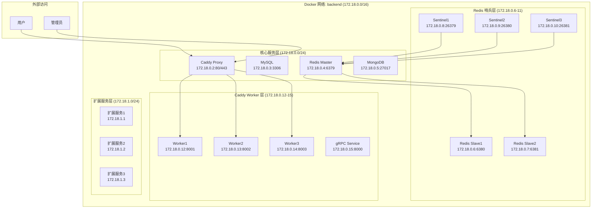

# docker-caddy 常规脚手架

基于 Docker Compose 的现代化开发环境，支持 Caddy 集群和 Redis 哨兵模式。

## 项目特性

- **Caddy 集群模式**: 1个主实例 + 3个worker，支持负载均衡和故障转移
- **Redis 哨兵模式**: 1个主节点 + 2个从节点 + 3个哨兵，提供高可用性
- **多语言支持**: Go、Python 测试和 Web 应用示例
- **统一管理**: Makefile 和专门脚本提供便捷的管理方式
- **开发友好**: 完整的测试套件和开发环境配置

## 快速开始

### 1. 初始化环境

```bash
# 初始化 Docker 网络和数据目录
./init.sh

# 复制环境配置文件（根据需求调整）
cp .env.example .env

# 编辑配置文件（可选）
vim .env
```

### 2. 选择部署模式

#### 集群模式（生产推荐）
```bash
# 启动开发环境（集群模式）
make dev
```

#### 单机模式（开发推荐）
```bash
# 使用专门的单机模式 Makefile
make -f Makefile.single help

# 启动单机模式
make -f Makefile.single up

# 查看单机模式状态
make -f Makefile.single status

# 查看单机模式日志
make -f Makefile.single logs

# 启动特定服务
make -f Makefile.single caddy
make -f Makefile.single redis
```

### 3. 服务组件

| 服务 | 版本 | 端口 | 说明 |
|------|------|------|------|
| Redis | 5.x (默认) | 6379-6381 | 哨兵模式，支持故障转移 |
| MySQL | 8.0 (默认) | 3306 | 关系型数据库 |
| MongoDB | 3.4 (默认) | 27017 | 文档数据库 |
| Caddy | latest | 80/443 | 集群模式，负载均衡 |
| Go | 1.24 | 8080 | Web 应用示例 |
| Python | 3.x | 8081 | Web 应用示例 |

## 集群架构

### Caddy 集群模式

```bash
# 启动 Caddy 集群
make caddy-start

# 检查集群状态
make caddy-status

# 查看集群日志
make caddy-logs

# 停止集群
make caddy-stop
```

> **详细文档**: 查看 [Caddy 配置文档](caddy/README.md) 了解完整的配置说明、使用方法和故障排除指南。

**集群架构**:
- 主入口: proxy (端口 80/443) - 负载均衡器
- Worker1: proxy-worker1 (端口 8001/1443)
- Worker2: proxy-worker2 (端口 8002/2443)  
- Worker3: proxy-worker3 (端口 8003/3443)

**特性**:
- 轮询负载均衡算法
- 健康检查机制
- 自动故障转移
- 统一日志记录

### Redis 哨兵模式

```bash
# 启动 Redis 哨兵模式
make redis-start

# 检查哨兵状态
make redis-status

# 测试哨兵功能
make redis-test

# 模拟故障转移
make redis-failover

# 查看哨兵日志
make redis-logs
```

> **详细文档**: 查看 [Redis 哨兵模式配置文档](redis/README.md) 了解完整的配置说明、使用注意事项和故障排除指南。

**哨兵架构**:
- 主节点: redis-master (端口 6379) - 处理写操作
- 从节点: redis-slave1 (端口 6380), redis-slave2 (端口 6381) - 复制主节点数据
- 哨兵节点: redis-sentinel1 (端口 26379), redis-sentinel2 (端口 26380), redis-sentinel3 (端口 26381) - 监控和故障转移

**特性**:
- 自动故障检测和转移
- 主从自动切换
- 配置自动更新
- 高可用性保证

## 管理命令

### 常用命令

```bash
# 查看所有可用命令
make help

# 开发环境管理
make dev            # 启动开发环境（集群模式）
make stop-all       # 停止所有服务
make status         # 查看所有服务状态
make full-test      # 完整测试流程

# 集群模式管理
make build          # 构建 Docker 镜像
make up             # 启动 Docker 服务
make down           # 停止 Docker 服务
make clean          # 清理 Docker 镜像

# 单机模式管理（使用专门的 Makefile）
make -f Makefile.single help     # 查看单机模式帮助
make -f Makefile.single build    # 构建单机模式镜像
make -f Makefile.single up       # 启动单机模式服务
make -f Makefile.single down     # 停止单机模式服务
make -f Makefile.single logs     # 查看单机模式日志
make -f Makefile.single status   # 查看单机模式状态
```

### 集群管理

```bash
# Redis 哨兵集群
make redis-start    # 启动 Redis 哨兵集群
make redis-stop     # 停止 Redis 哨兵集群
make redis-status   # 检查集群状态
make redis-test     # 测试集群功能
make redis-failover # 模拟故障转移
make redis-logs     # 查看集群日志

# Caddy 集群
make caddy-start    # 启动 Caddy 集群
make caddy-stop     # 停止 Caddy 集群
make caddy-status   # 检查集群状态
make caddy-logs     # 查看集群日志
```

### 测试和开发

```bash
# 测试管理
make test-go        # 运行 Go 语言测试
make test-py        # 运行 Python 语言测试
make test-all       # 运行所有测试

# Web 应用管理
make web-go         # 启动 Go Web 应用
make web-py         # 启动 Python Web 应用
make web-all        # 启动所有 Web 应用
```

### 传统 Docker Compose 方式

```bash
# 构建和启动
docker-compose build <services-names>
docker-compose up -d <services-names>

# 重启和重建
docker-compose restart <services-names>
docker-compose up -d --build <services-names>

# 停止和清理
docker-compose stop
docker-compose down
docker-compose down --rmi all
```

## 网络架构

### 网络拓扑



### IP 地址分配

| 服务类型 | IP 范围 | 用途 | 示例 |
|---------|---------|------|------|
| **核心服务** | 172.18.0.2-5 | 基础服务 | Caddy、MySQL、Redis、MongoDB |
| **Redis 集群** | 172.18.0.6-11 | 哨兵模式 | 主从节点 + 哨兵节点 |
| **Caddy 集群** | 172.18.0.12-15 | 负载均衡 | Worker 节点 + gRPC |
| **扩展服务** | 172.18.1.0/24 | 自定义服务 | 用户定义的服务 |

### 端口映射

#### 外部访问端口
| 服务 | 内部端口 | 外部端口 | 协议 | 说明 |
|------|----------|----------|------|------|
| Caddy | 80 | 80 | HTTP | 主入口 |
| Caddy | 443 | 443 | HTTPS | SSL 入口 |
| Caddy Worker1 | 8001 | 8001 | HTTP | 负载均衡测试 |
| Caddy Worker2 | 8002 | 8002 | HTTP | 负载均衡测试 |
| Caddy Worker3 | 8003 | 8003 | HTTP | 负载均衡测试 |
| Redis | 6379 | 6379 | TCP | 主节点 |
| MySQL | 3306 | 3306 | TCP | 数据库 |
| MongoDB | 27017 | 27017 | TCP | 文档数据库 |
| gRPC | 8000 | 8000 | HTTP | 微服务 |

#### 内部通信端口
| 服务 | 端口 | 协议 | 说明 |
|------|------|------|------|
| Redis Slave1 | 6380 | TCP | 从节点1 |
| Redis Slave2 | 6381 | TCP | 从节点2 |
| Redis Sentinel1 | 26379 | TCP | 哨兵1 |
| Redis Sentinel2 | 26380 | TCP | 哨兵2 |
| Redis Sentinel3 | 26381 | TCP | 哨兵3 |

### 网络配置

#### Docker 网络创建
```bash
# 创建自定义网络
docker network create \
  --driver bridge \
  --subnet=172.18.0.0/16 \
  --ip-range=172.18.0.0/24 \
  --gateway=172.18.0.1 \
  backend
```

#### 服务间通信
- **内部通信**：所有服务通过容器名进行通信
- **外部访问**：通过宿主机端口映射访问
- **负载均衡**：Caddy 自动分发请求到 Worker 节点
- **故障转移**：Redis 哨兵自动处理主从切换

#### 安全考虑
- **网络隔离**：所有服务运行在独立的 Docker 网络中
- **端口控制**：只暴露必要的端口到宿主机
- **内部通信**：服务间通信不经过宿主机网络
- **访问控制**：通过 Caddy 进行统一的访问控制

## 站点配置

### 已配置的站点

| 域名 | 用途 | 后端服务 | 端口 | 配置文件 |
|------|------|----------|------|----------|
| www | 主站点 | www-service | 3000 | 02-www.caddy |
| api | API 接口 | api-service | 8080 | 03-api.caddy |
| admin | 管理后台 | admin-service | 8081 | 04-admin.caddy |

### 添加新站点

1. **复制模板文件**：
   ```bash
   cp caddy/conf.d/00-example-caddy caddy/conf.d/05-your-site.caddy
   ```

2. **修改配置**：
   - 替换域名：`your-domain.com` → `your-site.com`
   - 修改后端服务：`your-service:port` → `your-service:8080`
   - 调整日志文件：`your-site.log` → `your-site.log`
   - 根据需要调整其他配置

3. **重启 Caddy**：
   ```bash
   make caddy-restart
   ```

### 站点特性

- **自动 HTTPS**：所有站点自动获取 Let's Encrypt SSL 证书
- **安全头**：包含完整的安全头配置
- **缓存控制**：针对不同文件类型的缓存策略
- **压缩**：Gzip 压缩支持
- **限流**：防止滥用和 DDoS 攻击
- **健康检查**：自动检测后端服务状态
- **日志记录**：详细的访问日志

## 项目结构

```
docker-caddy/
├── caddy/                   # Caddy 配置
│   ├── README.md            # Caddy 配置详细说明
│   ├── Caddyfile            # 主配置文件
│   ├── conf.d/              # 站点配置
│   │   ├── 00-example-caddy # 站点配置模板
│   │   ├── 02-www.caddy     # 主站点配置
│   │   ├── 03-api.caddy     # API 接口配置
│   │   └── 04-admin.caddy   # 管理后台配置
│   └── Dockerfile           # Caddy 镜像
├── redis/                   # Redis 配置
│   ├── README.md            # Redis 哨兵模式详细说明
│   ├── redis4.conf          # Redis 4.x 配置
│   ├── redis5.conf          # Redis 5.x 配置
│   ├── redis6.conf          # Redis 6.x 配置
│   ├── redis-slave.conf     # 从节点配置
│   ├── sentinel.conf        # 哨兵配置
│   └── Dockerfile           # Redis 镜像
├── mysql/                   # MySQL 配置
│   ├── docker.cnf           # MySQL 配置
│   └── Dockerfile           # MySQL 镜像
├── mongo/                   # MongoDB 配置
│   ├── mongod.conf          # MongoDB 配置
│   └── Dockerfile           # MongoDB 镜像
├── grpc/                    # gRPC 服务
│   ├── main.go              # gRPC 服务代码
│   ├── go.mod               # Go 模块文件
│   ├── go.sum               # Go 依赖锁定
│   └── Dockerfile           # gRPC 镜像
├── test/                    # 测试代码
│   ├── go/                  # Go 语言测试
│   │   ├── redis-config.go  # Redis 配置
│   │   ├── test-redis.go    # Redis 测试
│   │   ├── web-app.go       # Web 应用
│   │   ├── go.mod           # Go 模块
│   │   └── Makefile         # Go 构建脚本
│   ├── py/                  # Python 语言测试
│   │   ├── redis_config.py  # Redis 配置
│   │   ├── test_redis.py    # Redis 测试
│   │   ├── web_app.py       # Web 应用
│   │   ├── requirements.txt # Python 依赖
│   │   └── Makefile         # Python 构建脚本
│   ├── Makefile             # 测试管理脚本
│   └── README.md            # 测试说明文档
├── docker-compose.yml       # Docker 编排
├── docker-compose.single.yml # 单机模式 Docker 编排
├── .env.example             # 环境配置示例
├── Makefile                 # 项目管理
├── init.sh                  # 初始化脚本
├── cluster-manage.sh        # Caddy 集群管理
├── redis-sentinel-manage.sh # Redis 哨兵管理
├── LICENSE                  # 开源许可证
└── README.md                # 项目文档
```

## 致谢

感谢以下开源项目的贡献：

- [zhaopan/docker-devops](https://github.com/zhaopan/docker-devops)
- [ogenes/docker-lnmp](https://github.com/ogenes/docker-lnmp)
- [fatedier/frp](https://github.com/fatedier/frp)
- [snowdreamtech/frp](https://github.com/snowdreamtech/frp)
