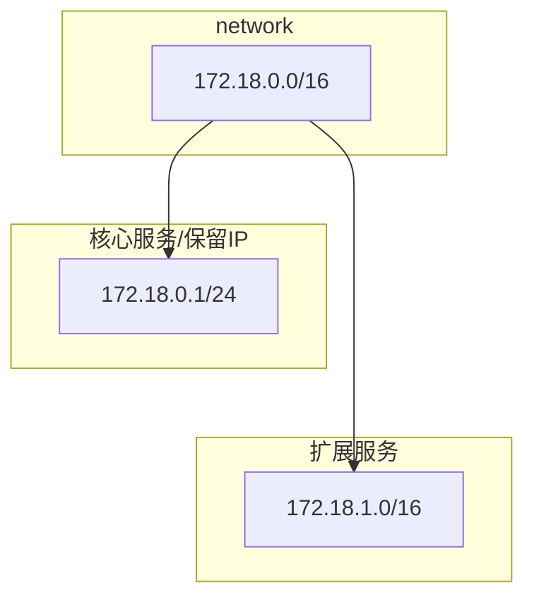

# docker-caddy 常规脚手架

## init

```bash
# copy 配置文件，根据自己需求修改配置文件
cp .env.example .env
chmod +x init.sh install.sh startup.sh
sh init.sh
```

## services-names

```bash
# redis 4.x | 5.x(默认) | 6.x
# mysql 5.7.40 | 8.0(默认)
# golang 1.24(默认)
# mongo 3.4(默认)
# caddy latest(默认)
```

## build

```bash
# build
docker-compose build <services-names>
```

## run | restart | stop | down | rebuild

```bash
# start 首次执行耗时较久，耐心等待
docker-compose up -d <services-names>

# restart 修改配置文件后重启即可
docker-compose restart <services-names>

# rebuild 修改 dockerfile 或者 env 文件之后 rebuild 可生效
docker-compose up -d --build <services-names>

# stop 停止
docker-compose stop

# down 停止 + 删除
docker-compose down

# down -rmi 停止 + 删除容器 + 删除镜像
docker-compose down --rmi all
```

## 网络拓扑图



## thanks

[zhaopan/docker-devops](https://github.com/zhaopan/docker-devops)

[ogenes/docker-lnmp](https://github.com/ogenes/docker-lnmp)

[fatedier/frp](https://github.com/fatedier/frp)

[snowdreamtech/frp](https://github.com/snowdreamtech/frp)
