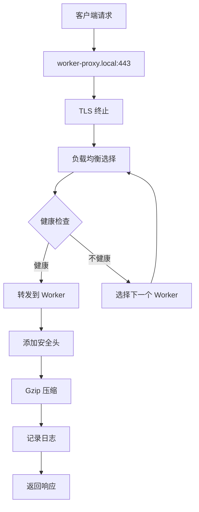

# Caddy Worker 代理配置详解

## 概述

`00-worker-proxy.caddy` 是 Caddy 集群模式的核心配置文件，实现了高可用、负载均衡和监控的完整解决方案。本文档详细解释其工作机制和配置原理。

## 架构设计

### 文件结构
```
caddy/conf.d/
├── 00-worker-proxy.caddy    # Worker 代理配置 (优先级最高)
├── 02-www.caddy             # 主站点配置
├── 03-api.caddy             # API 配置
└── 04-admin.caddy           # 管理配置
```

### 集群架构
```
客户端请求
    ↓
worker-proxy.local:443 (负载均衡器)
    ↓
┌─────────────────────────────────┐
│ 负载均衡分发                    │
├─────────────────────────────────┤
│ Worker1:8001  Worker2:8002     │
│ Worker3:8003                   │
└─────────────────────────────────┘
    ↓
响应返回
```

## 1. Worker 负载均衡代理

### 配置解析

#### 基本配置
```caddyfile
worker-proxy.local {
    tls internal
    # ... 其他配置
}
```

- **域名**: `worker-proxy.local` - 负载均衡器入口
- **TLS**: `tls internal` - 使用内部自签名证书（开发环境）

#### 负载均衡配置
```caddyfile
reverse_proxy {
    to caddy-worker1:80    # 目标1: Worker1
    to caddy-worker2:80    # 目标2: Worker2  
    to caddy-worker3:80    # 目标3: Worker3
    
    lb_policy round_robin  # 轮询策略
}
```

**工作原理**：
- 请求按顺序轮流分发到 3 个 Worker 节点
- 第1个请求 → Worker1，第2个请求 → Worker2，第3个请求 → Worker3，第4个请求 → Worker1...

#### 健康检查机制
```caddyfile
health_uri /health
health_interval 30s
health_timeout 5s
```

**工作流程**：
1. 每30秒向每个 Worker 的 `/health` 端点发送检查请求
2. 5秒内没有响应则标记为不健康
3. 不健康的节点会被暂时从负载均衡池中移除

#### 故障转移机制
```caddyfile
fail_duration 30s
max_fails 3
```

**故障处理**：
- 连续失败3次后，节点被标记为故障
- 故障节点被移除30秒
- 30秒后重新加入负载均衡池

### 请求处理流程



## 2. 健康检查端点

### 配置
```caddyfile
worker-health.local {
    tls internal
    respond "Worker cluster is healthy" 200
    
    header {
        X-Health-Check "true"
        X-Cluster-Status "healthy"
        X-Worker-Count "3"
    }
}
```

### 功能
- 提供集群健康状态的快速检查接口
- 返回简单的健康状态信息
- 包含集群元数据（Worker 数量等）

### 使用场景
- **监控系统检查** - 外部监控工具定期检查
- **容器健康检查** - Docker/K8s 健康探针
- **负载均衡器检查** - 上游负载均衡器状态检查

### 响应示例
```json
{
  "response": "Worker cluster is healthy",
  "status": 200,
  "headers": {
    "X-Health-Check": "true",
    "X-Cluster-Status": "healthy", 
    "X-Worker-Count": "3"
  }
}
```

## 3. 状态监控端点

### 配置
```caddyfile
worker-status.local {
    tls internal
    respond "Worker cluster status: active" 200
    
    header {
        Content-Type "application/json"
        X-Status-Endpoint "true"
        X-Cluster-Monitor "enabled"
    }
}
```

### 功能
- 提供详细的集群状态信息
- 用于监控和调试
- 返回 JSON 格式的状态数据

### 使用场景
- **运维监控** - 查看集群运行状态
- **故障排查** - 诊断集群问题
- **性能分析** - 监控集群性能指标

### 响应示例
```json
{
  "response": "Worker cluster status: active",
  "status": 200,
  "headers": {
    "Content-Type": "application/json",
    "X-Status-Endpoint": "true",
    "X-Cluster-Monitor": "enabled"
  }
}
```

## 4. 安全与性能配置

### 安全头设置
```caddyfile
header {
    # 安全防护
    X-Content-Type-Options "nosniff"
    X-Frame-Options "SAMEORIGIN" 
    X-XSS-Protection "1; mode=block"
    Referrer-Policy "strict-origin-when-cross-origin"
    
    # 负载均衡标识
    X-Load-Balancer "caddy-cluster"
    X-Backend-Servers "worker1,worker2,worker3"
}
```

**安全防护**：
- `X-Content-Type-Options: nosniff` - 防止 MIME 类型嗅探攻击
- `X-Frame-Options: SAMEORIGIN` - 防止点击劫持攻击
- `X-XSS-Protection: 1; mode=block` - 防止 XSS 攻击
- `Referrer-Policy: strict-origin-when-cross-origin` - 控制引用策略

**调试信息**：
- `X-Load-Balancer: caddy-cluster` - 标识请求经过了负载均衡器
- `X-Backend-Servers: worker1,worker2,worker3` - 显示可用的后端服务器列表

### 性能优化
```caddyfile
encode gzip
```
- 启用 Gzip 压缩，减少传输数据量
- 提高响应速度，降低带宽消耗

### 日志记录
```caddyfile
log {
    output file /data/logs/worker-proxy.log
    format json
    level INFO
}
```
- 记录所有请求到独立日志文件
- JSON 格式便于日志分析
- INFO 级别记录关键信息

## 5. 完整工作流程

### 正常请求处理
1. **请求到达** → `worker-proxy.local:443`
2. **TLS 终止** → 使用内部证书处理 HTTPS
3. **负载均衡** → 根据轮询策略选择 Worker
4. **健康检查** → 确保目标 Worker 可用
5. **请求转发** → 将请求发送到选定的 Worker
6. **响应处理** → 添加安全头和压缩
7. **日志记录** → 记录请求详情
8. **响应返回** → 将处理后的响应返回客户端

### 故障处理流程
1. **检测故障** → 健康检查失败
2. **标记故障** → 连续失败达到阈值
3. **移除节点** → 从负载均衡池中移除
4. **等待恢复** → 故障持续时间后重新检查
5. **重新加入** → 节点恢复后重新加入池

## 6. 实际应用场景

### 高可用 Web 服务
- 多个 Worker 节点提供相同的服务
- 单个节点故障不影响整体服务
- 自动故障转移和恢复

### 负载分散
- 请求均匀分布到各个 Worker
- 避免单个节点过载
- 提高整体处理能力

### 监控和运维
- 实时健康状态检查
- 详细的运行状态监控
- 便于故障排查和性能调优

## 7. 配置调优建议

### 负载均衡策略
- **round_robin** (默认) - 轮询，适合大多数场景
- **least_conn** - 最少连接，适合长连接场景
- **ip_hash** - IP 哈希，适合需要会话保持的场景

### 健康检查调优
```caddyfile
health_interval 10s    # 更频繁的检查（默认30s）
health_timeout 3s      # 更短的超时（默认5s）
```

### 故障转移调优
```caddyfile
fail_duration 60s      # 更长的故障持续时间（默认30s）
max_fails 5            # 更多的失败次数（默认3）
```

## 8. 监控指标

### 关键指标
- **请求响应时间** - 平均响应时间
- **健康检查状态** - 各 Worker 节点健康状态
- **故障转移次数** - 故障转移频率
- **负载分布** - 各 Worker 节点的请求分布

### 日志分析
```bash
# 查看负载均衡日志
docker exec caddy tail -f /data/logs/worker-proxy.log

# 查看健康检查日志
docker exec caddy tail -f /data/logs/worker-health.log

# 查看状态监控日志
docker exec caddy tail -f /data/logs/worker-status.log
```

## 9. 最佳实践

### 部署建议
1. **至少3个 Worker 节点** - 确保高可用性
2. **定期健康检查** - 及时发现和处理故障
3. **监控和告警** - 设置关键指标的监控和告警
4. **日志轮转** - 配置日志轮转避免磁盘空间问题

### 安全建议
1. **使用 HTTPS** - 生产环境使用真实证书
2. **限制访问** - 健康检查和状态端点限制访问
3. **定期更新** - 保持 Caddy 版本更新
4. **安全头配置** - 根据实际需求调整安全头

### 性能建议
1. **启用压缩** - 减少传输数据量
2. **连接池** - 合理配置连接池大小
3. **缓存策略** - 根据业务需求配置缓存
4. **资源监控** - 监控 CPU、内存、网络使用情况

## 10. 相关文档

- [Caddy 官方文档](https://caddyserver.com/docs/)
- [Caddy 反向代理配置](https://caddyserver.com/docs/caddyfile/directives/reverse_proxy)
- [Caddy 负载均衡配置](https://caddyserver.com/docs/caddyfile/directives/reverse_proxy#load-balancing)

---

**这个配置文件是 Caddy 集群的核心，实现了高可用、负载均衡和监控的完整解决方案！**
